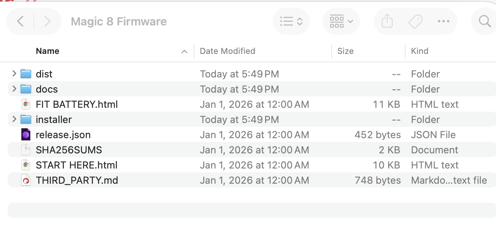
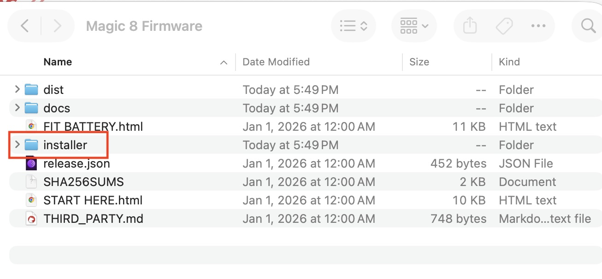
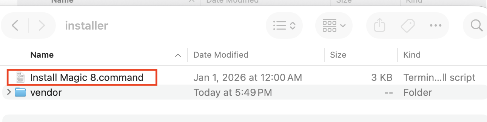
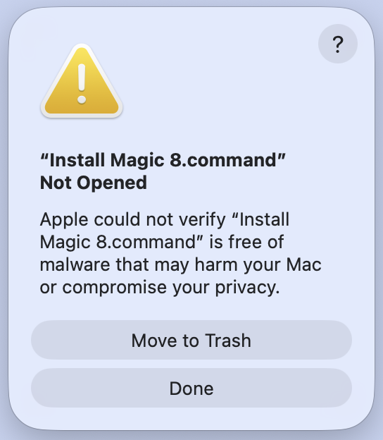
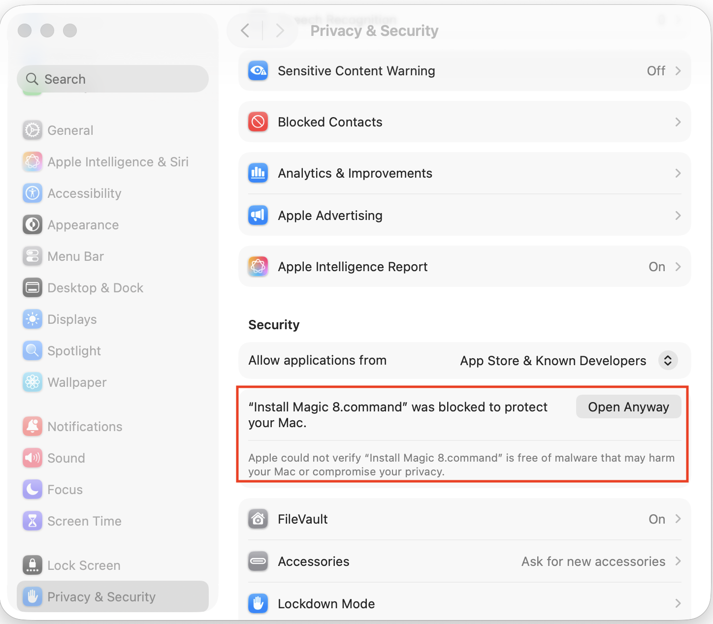
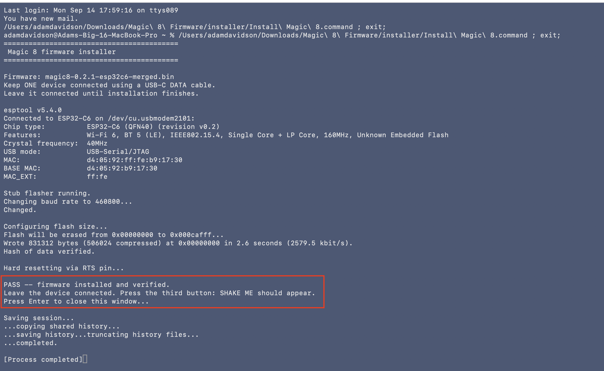
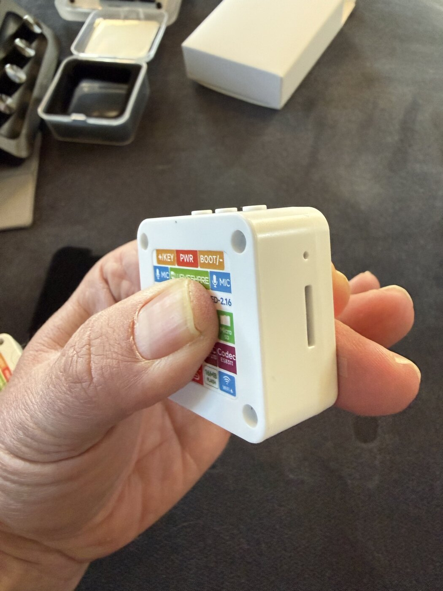

# Install Magic 8 on a Mac

## Before you begin

Have these three things ready:

- **A Mac** — Apple Silicon or Intel.
- **One Magic 8 device.** Connect only one at a time.
- **A USB-C data cable.** A charging-only cable will not work.

**Battery still loose in the box?** Follow the **[illustrated battery guide](docs/BATTERY.md)** first. If the battery is already fitted, leave the case closed.

---

# 1. [Download for Mac](https://github.com/adamjdavidson/feedforward_device_firmware/releases/download/v0.2.1-guide3/Magic8-Firmware-0.2.1-mac.zip)

1. Click **Download for Mac** above.
2. Open **Downloads** in Finder.
3. Double-click **Magic8-Firmware-0.2.1-mac.zip** to unzip it.
4. Open the new **Magic 8 Firmware** folder.

## 2. Connect the device

- Plug **one device** into your Mac with the USB-C data cable.
- Disconnect any other devices you are preparing.
- Leave this device plugged in until you see **PASS**.

## 3. Open “Install Magic 8.command”

Inside the downloaded **Magic 8 Firmware** folder:

1. Open the **installer** folder.

    

2. Double-click **Install Magic 8.command**.

    

A window called **Terminal** will open when the installer is allowed to run. It handles the installation automatically. **You do not type anything.**

## 4. If Apple blocks it: allow it in Settings

You may see this warning:

> **Apple could not verify “Install Magic 8.command” is free of malware that may harm your Mac or compromise your privacy.**

<!-- {"width":231} -->

**Do not click “Move to Trash.”**  
This software is safe, it just hasn’t been officially approved by Apple.

1. **Click Done.**
2. Switch to **System Settings** from the Apple menu at the top left of your screen.
3. Click **Privacy & Security**.
4. Scroll down to **Security**.
5. Find the message about **Install Magic 8.command** and click **Open Anyway**.

    <!-- {"width":355} -->

6. Enter your Mac password or use Touch ID if asked.
7. Click **Open** in the confirmation. If installation has not started, double-click **Install Magic 8.command** again.

## 5. Wait for “PASS”

- A terminal window will open and automatically begin the install
- Watch the percentages count up. It shouldn’t take more than a few seconds.
- **Keep the cable connected.**
- Wait for this exact message:

> **PASS -- firmware installed and verified.**

(**Seeing FAILED instead?** Use the **[troubleshooting table](#troubleshooting)** below.)

## 6. Check that it works

Keep the device plugged in for this check.

| Do this                                                      | You should see                   |
|--------------------------------------------------------------|----------------------------------|
| Press the button furthest to the right when looking at the screen.  | **SHAKE ME** on a cream screen   |
| Shake the device                                             | A swirl, then an AI move         |
| Tap anywhere on the screen                                   | An extra sentence about the move |
| Tap anywhere again                                           | A QR code                        |
| Scan the QR code with your phone                             | The page for that move           |

**Which button?** Use the right-most button labeled **+/KEY**. It is the third button when counting from the **BOOT** end. **PWR** is the middle button.

*Your device's rear label identifies the buttons. This photo shows the +/KEY button at the left of the row.*

## Ready for the next device?

1. Unplug the device you have finished checking.
2. Plug in the next device.
3. Double-click **Install Magic 8.command** again.

**Reuse the same downloaded folder.** You do not need to download the software for every device.

## If something goes wrong

| What you see | What to do |
|---|---|
| Apple's warning, with **Move to Trash** | Follow **[Step 4: allow it in Settings](#mac-approval)**. |
| No **Open Anyway** button | Try opening the installer once more, then return to **Privacy & Security**. If it is still absent, report the exact message. |
| **No device found** or a connection timeout | Check the cable carries data. Try another cable or USB port. If the device already runs Magic 8, press **KEY** once after connecting it. |
| More than one device found | Disconnect other USB serial devices. Leave only the Magic 8 connected. |
| A **checksum** or missing-file message | Download and unzip a fresh complete Mac ZIP. Keep its files together. |
| A write or verification error | Unplug, reconnect, and retry once. |
| **PASS**, but no **SHAKE ME** after pressing **KEY** | Retry the installation once. If it still fails, set the device aside. |

**If the same problem happens twice:** stop on that device, photograph the exact message, and note which step failed.

<!-- maintainer-links -->

---

**Other information:** [Battery fitting and charging](docs/BATTERY.md) · [Release notes](https://github.com/adamjdavidson/feedforward_device_firmware/releases/tag/v0.2.1-guide3) · [For maintainers](docs/RELEASE.md) · [Bundled software](THIRD_PARTY.md)
