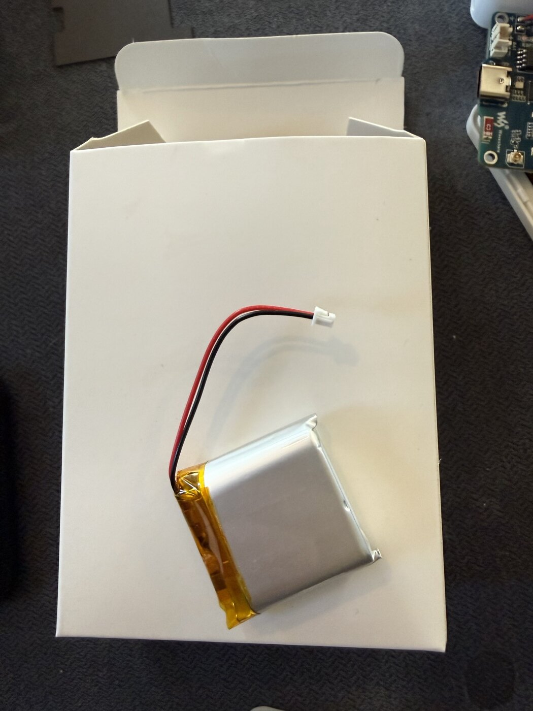
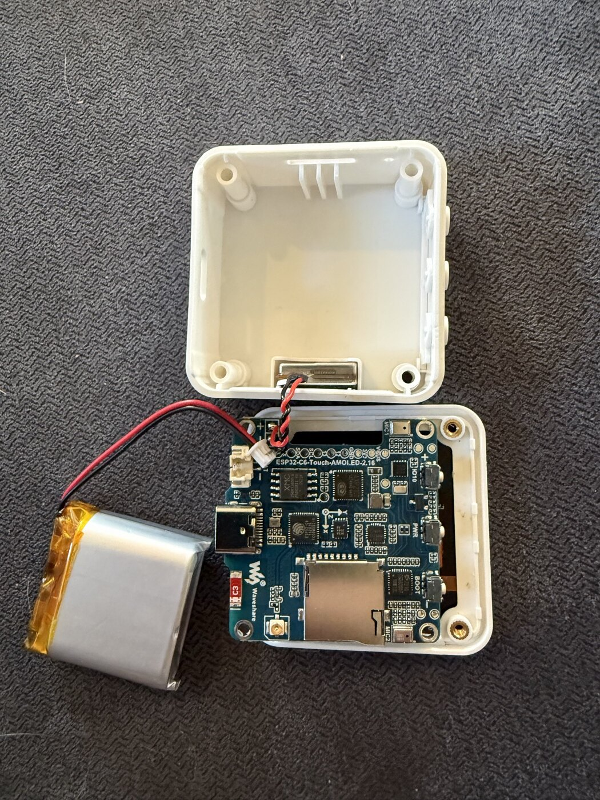
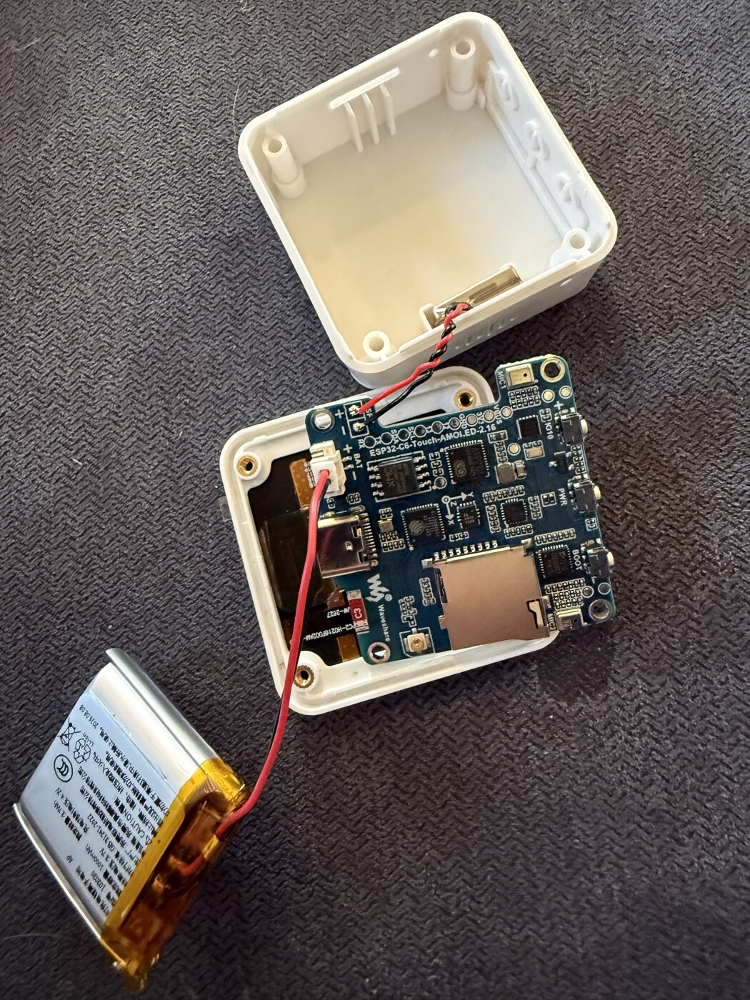
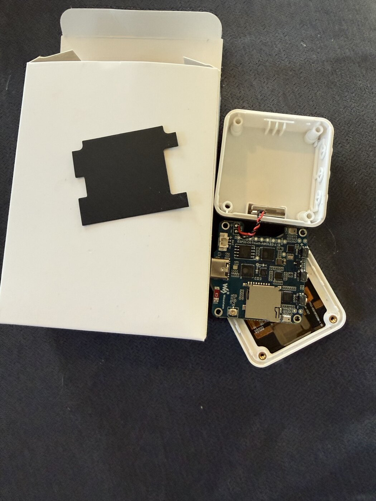
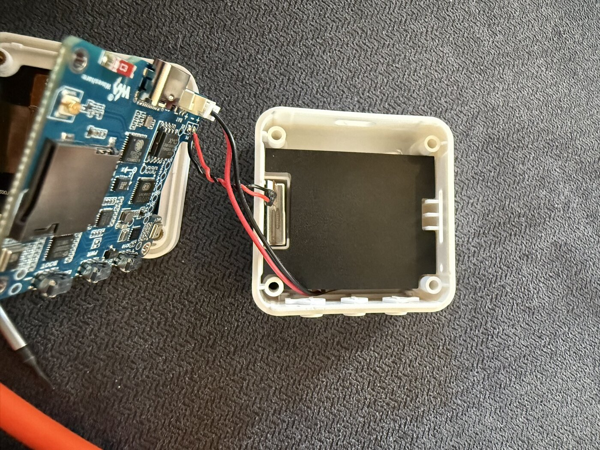

# Fit the battery

**The battery arrives loose. Fit it before preparing a device for use.**

- **Already fitted?** Leave the case closed and [go to the Mac installation steps](../README.md).
- **USB cable connected?** Unplug it before opening the case.

> **Assembly guide:** these photos show the actual device and parts. Use the first unit to confirm the fit before repeating the assembly across the batch.

## Watch the installation

**[Download the battery installation video (4 min 8 sec)](videos/battery-installation.mp4?raw=true)**

## Gather the parts

- **The device and its supplied 3.7 V, 1000 mAh battery.**
- **A PH00 (#00) Phillips screwdriver.**
- **The black electrical-insulation sheet.** It must separate the battery from the circuit board.
- **A soft, clean cloth** to protect the screen.
- **A small tray** for the four screws.
- **Optional:** 0.5 mm EVA foam tape, only if the battery rattles.

*This is the loose battery and its white plug. Keep the orange tape in place.*

**Before handling the battery:**

- Do not use a swollen, punctured, leaking, sharply creased or damaged battery.
- Do not bend, squeeze, puncture or tightly tape the battery.
- Keep loose screws and metal objects away from the open circuit board.

## 1. Open the rear cover

1. Put the device **screen-down on the cloth**.
2. Remove the **four rear screws** and put them in the tray.
3. Lift the rear cover gently and place it beside the device.

**The cover is connected by speaker wires.** Leave those wires attached and slack. Keep the circuit board and display seated in the front of the case.

*The short twisted wires belong to the speaker. The loose battery has its own longer wires and white plug.*

**Cover sticking?** Ease the seam with a fingernail or plastic pick. Do not insert a metal tool or lever against the screen.

## 2. Find the battery socket

- Find the **metal USB-C socket** at the edge of the board.
- Beside it, find the **small cream-colored socket marked BAT**.
- Find the **+** and **−** marks next to that socket.

**Use the BAT socket only.** Leave the speaker's soldered wires and other connectors alone.

## 3. Check the wire colors, then insert the plug

> **Check this on every device: RED → + and BLACK → −.**
>
> The plug can go in backwards. **Match the wire colors to the marks printed on the board before pushing it in.**

1. Hold the **white plastic plug**, not its wires.
2. Line up **red with +** and **black with −** at the **BAT** socket.
3. Push the plastic plug gently and evenly into the socket.
4. Check that it is **level and fully seated**, with no exposed contacts.

*The battery plug is seated beside the USB-C port. Use the + and − marks at BAT to check polarity; other + and − marks on the board belong to other connections.*

**If the plug resists, tilts or the colors do not match:** stop and check it again. Do not force it.

The screen may light up, or it may stay dark. **Neither outcome proves that the battery has enough charge yet.**

## 4. Place the battery and insulating sheet

**The required layers, from the rear cover toward the screen:**

1. Rear cover.
2. Optional thin foam, only if needed.
3. Battery.
4. **Black insulating sheet.**
5. Circuit board.
6. Screen.

*This photo shows a shaped sample sheet. Its cutouts leave room for the case posts and wires.*

- Lay the battery flat in the space under the rear cover.
- Put the **black sheet between the battery and the circuit board**.
- Route the wires in relaxed curves, clear of the screw holes and case edges.
- Keep the sheet clear of buttons, ports and all four screw posts.
- Make sure the battery's silver pouch cannot touch exposed circuit-board parts.

*The battery is beneath the black sheet in the rear cover. The board was lifted in this reference photo so the layers are visible; you do not need to detach the board or display to follow these steps.*

### If you need to cut a replacement sheet

Use **black flame-retardant polycarbonate electrical-insulation film**:

- **0.20–0.25 mm thick** (8–10 mil).
- **UL 94 V-0 or VTM-0** rated.
- Non-conductive, with **no metal or foil**.

Cut and test **one template** before making the rest. It must cover the area between battery and board while leaving the posts, buttons, ports and wire route clear. Foam does **not** replace the insulating sheet.

## 5. Close the case

1. Hold the cover in place **without screws**. It must sit flat without pressure.
2. Tilt the device once. **No rattle?** No foam is needed.
3. **If it rattles:** add one small piece of 0.5 mm EVA foam to the inside center of the rear cover. Keep it clear of wires and posts. The cover must still close without pressure.
4. Check that no wire is pinched and the cover sits flush on all four sides.
5. Start all four screws loosely.
6. Tighten diagonally, **snug rather than tight**.

**If the cover bulges or leaves a gap:** reopen it and reposition the battery or wires. Do not use the screws to pull it shut.

## 6. Install the software

**[Continue to the Mac installation steps →](../README.md)**

## What the charging dot means

The dot appears on the dark resting screen and on **SHAKE ME**.

| Dot | Meaning |
|---|---|
| **Amber** | Charging. |
| **Green** | Ready to use. It can continue charging while connected. |
| **Solid red, unplugged** | Low battery; connect USB to charge it. |
| **Blinking red** | Needs attention. A missing battery can cause this. |

After plugging in a sleeping device, allow a few seconds for the dot to appear.

### What is still being checked

- A minimum charge time before testing a newly fitted battery without USB.
- How long charging takes.
- The middle **PWR** button's full power-off/start-up procedure.

**Working on USB does not prove the battery is working.** Do not classify a newly fitted battery as faulty just because the device will not immediately start without the cable.
